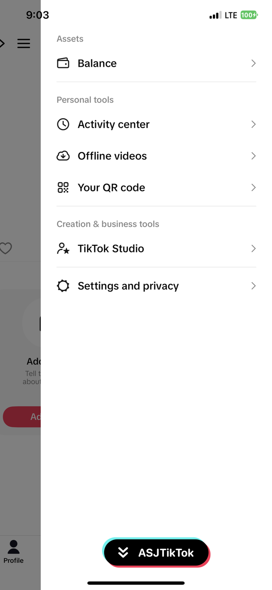
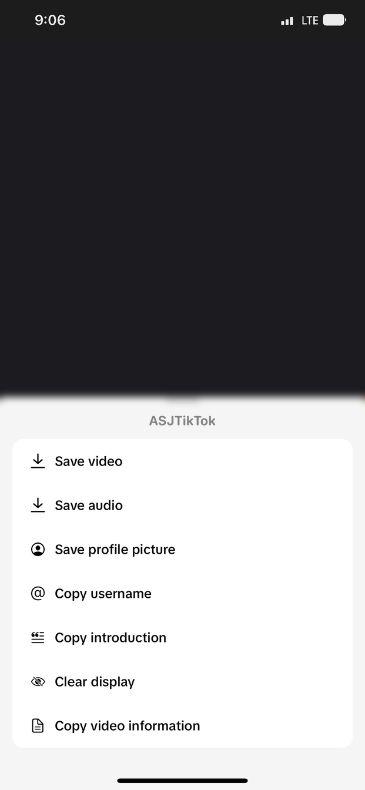
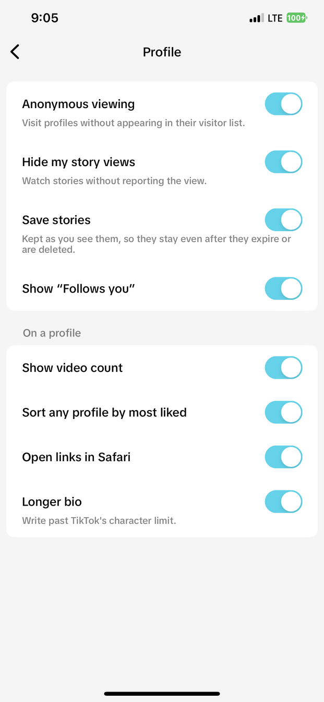
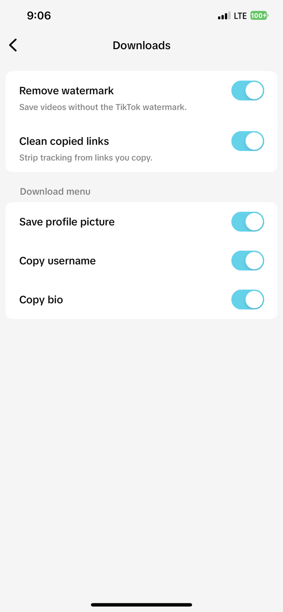
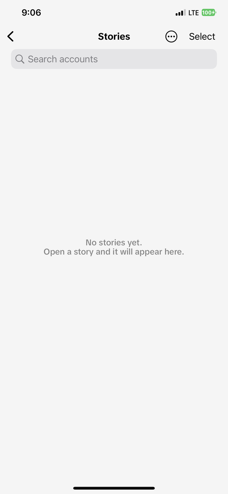

<div align="center">


# ASJTikTok

**Privacy, download and playback options for TikTok — without changing how the app looks.**

Add the source in Sileo, Zebra, Cydia or Installer:

```
https://asjrx.github.io/
```

</div>

---

## Where it lives

Everything is off after a fresh install — turn on only what you want. Two ways in: a button inside your profile menu, and a row inside TikTok's own Settings.

<p align="center">
  
  
  
</p>

The button on the right of any video opens the save menu: **Save video**, **Save audio**, **Save profile picture**, **Copy username**, **Copy introduction**, **Clear display** and **Copy video information**. On a photo post it saves the whole slideshow instead.

---

## Features

### Feed


- **Content country** — watch another region's For You
- **Remove ads**
- **Skip suggested accounts**
- **Hide LIVE**
- **Open on Following**
- **Hide safety warnings** and **sensitive content warnings**

<br clear="right">

### Playback


- **Auto scroll** — move to the next video when one ends
- **Prevent video loop** — pause at the end instead of replaying
- **Play sound in muted videos**
- **Always show progress bar**
- On the video: **country**, **like count** and **upload date**

<br clear="right">

### Messages


- **Hide message views** — read without telling the sender
- **Always show read receipts** — keep seeing theirs while yours stay hidden
- **Alert when read** — the moment someone reads your message
- **Hide typing** and **Hide active status**
- **Full last seen time** instead of "2h ago"
- **Keep deleted messages** in the chat
- **Save DM GIFs**

<br clear="right">

### Profile


- **Anonymous viewing** — no entry in their visitor list
- **Hide my story views**
- **Save stories** — they stay after they expire or are deleted
- **Show "Follows you"** and **video count**
- **Sort any profile by most liked**
- **Open links in Safari**
- **Longer bio**

<br clear="right">

### Comments, LIVE and downloads
<p>
  
  
  
  
</p>

- **View disabled comments**, **longer comments**, **save comment media**
- **Auto like button** for LIVE — draggable, with a count limit
- **Remove watermark** and **clean copied links**
- **Save profile picture**, **copy username**, **copy bio**
- Saved stories are collected in their own screen

### Extras
- **Clear Display** — hide the whole interface while watching, one tap to restore
- Brings the **Community tab** back when TikTok drops it at launch

---

## Install

### Jailbroken

Add the source above, or download a package from [Releases](../../releases) and install it with Sileo or Zebra.

| Jailbreak | Package |
|---|---|
| Dopamine / palera1n (rootless) | `ASJTikTok` — `iphoneos-arm64` |
| checkra1n / unc0ver and similar (rootful) | `ASJTikTok` — `iphoneos-arm64e` |
| roothide | `ASJTikTok (roothide)` |

Sileo picks the right architecture on its own; roothide is a separate entry.

### Not jailbroken

Download `ASJTikTok.dylib` from [Releases](../../releases) and inject it into your own copy of TikTok with Sideloadly or eSign, then sign and install.

> The dylib is self-contained and does not need Cydia Substrate, so any injector works.
> TikTok itself is not distributed here — bring your own copy.

---

## Notes

- Built against TikTok 46.3.0, arm64 and arm64e
- Screenshots are from a real install, not mockups

<div align="center"><sub>by <a href="https://github.com/asjrx">ASJRX</a></sub></div>
